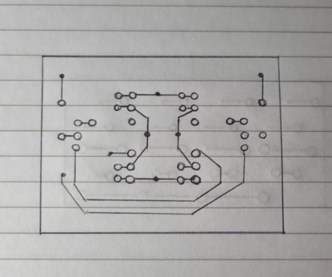

# Informe

## Breve descripción del circuito:

A través de un microcontrolador Raspberry pi pico se controla con el PWM de sus pines los distintos leds que significan las luces de un auto, estos leds están accionados por medio de un transistor que con el PWM regula la intensidad dependiendo de su necesidad.

Además, por medio de sensores ultrasónicos y motores mas un puente h el auto detecta cuando debe parar y girar hacia otro lado.

## Circuito esquemático:

## Lista de componentes:

Porta pilas doble a para 4 unidades (6v en total)

Raspberry pi pico

2 motores con rueda de 3-6v

2 led rojos

2 led amarillos

2 sensores supersónicos

Cables

Soporte de madera

Rueda libre

Transistores 4 tip32 y 4 tip31

8 diodos 

8 resistencias 1k 

4 resistencias 470

8 transistores bc337

4 resistencias 10k

## PCB:

Placa para control de leds

Placa para los puentes h

Foto del circuito:

## Mediciones:

|Puente H|Tensión marcha|Tensión contramarcha|Corriente motor|
| :- | :- | :- | :- |
|Puente 1|5,21v|5,47v|186mA|
|Puente 2|5,12v|5,50v|179mA|

|Control de leds|Tensión baja|Tensión alta|Corriente ib alta|Corriente Ib baja|Corriente en alta|Corriente en baja|
| :- | :- | :- | :- | :- | :- | :- |
|LEDS|4,32v|5,9v|260uA|64uA|3,7mA|1mA|
## Conclusión:

Se utilizó PWM para la base de transistores que cambiarían la intensidad de leds para indicar los movimientos del auto, el circuito tuvo fallas ya que activamos ambas partes del puente h por error, pero cambiando los transistores logramos hacer que vuelva a funcionar. Necesitamos usar 3 placas PCB para optimizar espacios.

